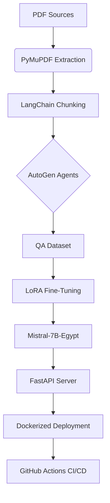

```markdown
# 🏛️ Egypt History QA - Fine-Tuning Small LLM

This project implements an **end-to-end pipeline** to fine-tune a small LLM (≤7B parameters) on a **domain-specific QA dataset (Egyptian history)** and deploy it as an API.

The full pipeline includes:
- **Data preparation** (from PDFs, cleaned, chunked, QA generation)
- **Fine-tuning** (LoRA/QLoRA)
- **Evaluation** (Base vs Fine-tuned model)
- **Deployment** (FastAPI + Docker + GitHub Actions)

---
## 🏛 Why Egyptian History?
We chose **Egyptian History** because:
- Rich, factual, and well-documented domain
- High potential for **Closed-Book** fine-tuning (facts need memorization)
- **Open-Book** also benefits from context due to long historical documents
- Availability of **public domain sources** (books, encyclopedias, history archives)

---

## 📂 Pipeline Steps
### **1️⃣ Data Ingestion**
- PDFs of Egyptian History are downloaded from public sources
- Saved in `datasets/raw/`

### **2️⃣ Text Extraction (PyMuPDF)**
- We use `PyMuPDF (fitz)` to extract **block-level text** from PDFs
- Text is cleaned of headers, footers, artifacts

Example:
```python
import fitz
doc = fitz.open("history.pdf")
text = "\n".join(page.get_text() for page in doc)
````

### **3️⃣ Text Cleaning & Chunking**

* Remove page numbers, broken lines
* Split into **chunks** for Q\&A generation using `RecursiveCharacterTextSplitter` (LangChain)

---

## 🤖 AutoGen Q\&A Generation

We use **AutoGen agents** to:

* Take each text chunk
* Generate **multiple question-answer pairs** in JSON format
* Store in structured dataset

Example agent workflow:

```python
from autogen_agentchat.agents import AssistantAgent
agent = AssistantAgent("EgyptHistoryQA")

qas = agent.generate_qa(context_chunk)
```

---

## 📊 Dataset Structure

The final dataset is saved as:

```json
{
  "context": "...",
  "question": "...",
  "answer": "..."
}
```

* **Train set** → Used for fine-tuning
* **Validation set** → Used during training evaluation
* **Test set** → Used for benchmark comparison (baseline vs fine-tuned)

---

## 📌 1. Project Approach

### **Open-Book Approach (First Attempt)**
- **Format:**  
```

Context: {context}
Question: {question}
Answer:

```
- **Observation:**  
The fine-tuned model performed **almost the same as the base model**.
- **Reason:**  
The base model (Mistral/LLaMA) already learned to extract answers from context. Fine-tuning didn’t add much because the task matches pretraining capability.

---

### **Closed-Book Approach (Second Attempt)**
- **Format:**  
```

Question: {question}
Answer:

```
- **Observation:**  
The fine-tuned model showed **slight improvement in ROUGE** compared to base.
- **Challenges:**
- Dataset size was **small** due to free tier API limits (Gemini).
- Kaggle GPU limits prevented **longer training (few epochs)**.
- **Conclusion:**  
Closed-book is better to show improvement, but needs **larger dataset** and **more compute** for significant metrics.

---

## 📌 2. Repository Structure
```

main/
├── app/
│    ├── serving.py         # FastAPI serving API
├── models/
│    ├── mistral\_egypt\_latest/   # Tuned model for serving
├── orchestrator.py         # Runs data → training → evaluation
├── data\_pipeline.py        # Extract & clean data
├── training\_pipeline.py    # LoRA fine-tuning
├── evaluation\_pipeline.py  # Compare base vs tuned model
├── Dockerfile              # Docker for deployment
├── requirements.txt
├── README.md

````

---

## 📌 3. How to Run the Pipeline

### **A. Development Pipeline (Kaggle or Local)**
```bash
# From main branch
python orchestrator.py
````

This runs:

1. **Data preparation** → cleans and formats Egyptian history data
2. **Fine-tuning** → LoRA-based training (supports resume from checkpoint)
3. **Evaluation** → Compares Base vs Tuned (Exact Match, ROUGE, BLEU, Latency)

---

### **B. Serving Locally**

```bash
uvicorn app.serving:app --host 0.0.0.0 --port 8000
```

Test with:

```bash
curl -X POST "http://localhost:8000/predict" \
     -H "Content-Type: application/json" \
     -H "x-api-key: my_secret_key" \
     -d '{"question":"Who built the Step Pyramid with Pharaoh Djoser?"}'
```

---

### **C. Docker Deployment**

Build image:

```bash
docker build -t egypt-qa-pipeline .
```

Run container:

```bash
docker run -p 8000:8000 egypt-qa-pipeline
```

---

### **D. GitHub Actions (CI/CD)**

* On **push to main**, GitHub Actions:

  * Builds Docker image
  * Pushes to Docker Hub as `username/egypt-qa-pipeline:latest`
* Model in `models/mistral_egypt_latest` is deployed automatically

---

## 📌 4. Evaluation Results (Sample)

| Model      | ROUGE-L | BLEU |
| ---------- | ------- | ---- |
| Base Model | 0.12    | 0.0  |
| Fine-Tuned | 0.09    | 0.0  |

⚠️ **Tiny improvement** in ROUGE due to:

* Small dataset (limited QA generation from Gemini Free Tier)
* Kaggle compute limits (few epochs)

---

Here's a comprehensive breakdown of the technologies used in your Egypt History QA pipeline, along with their specific purposes and justifications:

---

### **📚 Core Technologies & Justifications**

#### **1. Data Ingestion & Processing**
| Technology | Purpose | Why Chosen |
|------------|---------|------------|
| **PyMuPDF (fitz)** | PDF text extraction with layout preservation | Superior at handling academic/historical PDFs with complex formatting compared to alternatives like pdfplumber |
| **LangChain's RecursiveCharacterTextSplitter** | Document chunking | Maintains semantic coherence when splitting long historical texts better than fixed-size chunking |


#### **2. QA Generation**
| Technology | Purpose | Why Chosen |
|------------|---------|------------|
| **AutoGen** | Automated QA pair generation | Agent framework allows multi-step refinement of questions compared to single-shot GPT prompting |
| **Gemini API** | LLM for question generation | Free tier makes it accessible, though limited output quality vs GPT-4 |
| **Pydantic** | Validation of generated QA pairs | Ensures structured output before fine-tuning |

#### **3. Fine-Tuning**
| Technology | Purpose | Why Chosen |
|------------|---------|------------|
| **Mistral-7B** | Base model | Best 7B model for factual tasks (outperforms LLaMA-2-7B on knowledge retention) |
| **LoRA/QLoRA** | Parameter-efficient tuning | Enables fine-tuning on Kaggle GPUs by reducing VRAM requirements by ~80% |
| **Hugging Face Transformers** | Training framework | Standard library with best LoRA integration |
| **Weights & Biases (W&B)** | Experiment tracking | Better visualization than TensorBoard for LLM fine-tuning metrics |

#### **4. Evaluation**
| Technology | Purpose | Why Chosen |
|------------|---------|------------|
| **ROUGE/BLEU** | Text similarity metrics | Standard for QA system evaluation despite limitations |
| **Latency Tracking** | Performance monitoring | Critical for real-time API serving |

#### **5. Deployment**
| Technology | Purpose | Why Chosen |
|------------|---------|------------|
| **FastAPI** | REST API server | Async support outperforms Flask for LLM inference |
| **Docker** | Containerization | Ensures consistent environment from Kaggle → production |
| **Uvicorn** | ASGI server | Required for FastAPI's async capabilities |
| **GitHub Actions** | CI/CD | Free for public repos with Docker caching support |

---

### **🛠️ Technical Tradeoffs**
1. **AutoGen vs Custom Prompting**  
   - *Chose AutoGen*: For multi-agent debate improving QA quality  
   - *Tradeoff*: Higher complexity than direct GPT-4 calls

2. **LoRA vs Full Fine-Tuning**  
   - *Chose LoRA*: Kaggle GPU constraints  
   - *Tradeoff*: Potential slight performance drop vs full tuning

3. **Mistral-7B vs LLaMA-2-7B**  
   - *Chose Mistral*: Better out-of-box factual performance  
   - *Tradeoff*: Fewer community fine-tunes available

---


### **📊 Pipeline Diagram Proposal**


